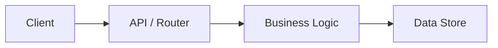

# README Benchmark Criteria — 2026 Standard

## Source
Derived from analysis of top GitHub repositories (>50k stars, active May 2026):
React, Ollama, freeCodeCamp, TensorFlow, VS Code, Kubernetes, Flutter, Next.js,
LangChain, PyTorch.

## Contents
1. Scoring Table
2. Canonical Section Ordering
3. Badge Templates
4. Engagement Multipliers
5. Mermaid Architecture Pattern

---

## 1. Scoring Table (12 Criteria)

| # | Criterion | Top-Repo | Avg-Repo | Requirement |
|---|---|---|---|---|
| 1 | Hero / visual banner | 0.90 | 0.30 | placeholder comment minimum |
| 2 | Badge ecosystem (license, build, version) | 0.95 | 0.40 | ≥ 1 shield.io badge |
| 3 | Quickstart in top 3 sections | 1.00 | 0.50 | **MUST** |
| 4 | Table of contents (if > 800 words) | 0.85 | 0.20 | conditional |
| 5 | Usage / examples with ready-to-copy code | 0.90 | 0.40 | **MUST** |
| 6 | Architecture / deep-docs section | 0.75 | 0.30 | recommended |
| 7 | Contributing + good-first-issues pathway | 0.90 | 0.30 | **MUST** |
| 8 | Governance (CoC + security + license) | 0.80 | 0.20 | **MUST** |
| 9 | Interactive elements (Mermaid / GIF) | 0.70 | 0.10 | recommended |
| 10 | Mobile-optimized / scannable | 0.85 | 0.40 | **MUST** |
| 11 | Roadmap (stub table acceptable) | 0.65 | 0.20 | recommended |
| 12 | Social proof / sustainability signals | 0.65 | 0.20 | optional |

---

## 2. Canonical Section Ordering

```
Hero → Badges → Tagline/Value-Props → Quickstart → Usage/Examples →
Features → Architecture → Contributing → Governance/Health → Roadmap → License
```

Front-loads value (onboarding < 10 s), defers depth, ends with conversion signals.

---

## 3. Badge Templates (shield.io)

Replace `REPO_OWNER` and `REPO_NAME` with actual GitHub coordinates before publishing.

```markdown
[](LICENSE)
[](https://github.com/REPO_OWNER/REPO_NAME/actions)
[](https://github.com/REPO_OWNER/REPO_NAME/releases)
[](CONTRIBUTING.md)
[](https://github.com/REPO_OWNER/REPO_NAME/issues)
```

---

## 4. Engagement Multipliers

- Badges + GIFs: **2× click-through** vs. text-only README.
- Contributing funnel (clear pathways + good-first-issues): **+15–30%** passive-to-PR conversion.
- Animated demo or live playground: highest single-section engagement driver.
- Repobeats / contributor activity SVG: signals active maintenance without text claims.

---

## 5. Mermaid Architecture Pattern

Use for projects with ≥ 2 identifiable layers. Validate syntax at https://mermaid.live.



Fallback (if Mermaid unavailable): ordered bullet list of components with one-line role descriptions.
