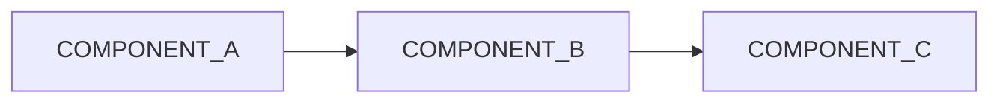

# README Skeleton — 2026 Production Standard

Section labels [S1]–[S11] correspond to Phase 3 section numbers in SKILL.md.
Replace ALL_CAPS_SNAKE tokens with project-specific values before publishing.
Remove HTML comments before publishing (they are authoring guidance only).

---

<!-- [S1] Hero / banner — replace src with a real image URL, or delete this block -->
<p align="center">
  
</p>

<!-- [S2] Badge row -->
[](LICENSE)
[](https://github.com/REPO_OWNER/REPO_NAME/actions)
[](https://github.com/REPO_OWNER/REPO_NAME/releases)
[](CONTRIBUTING.md)

<!-- [S3] Tagline + value props -->
# PROJECT_NAME

**ONE_SENTENCE_TAGLINE_DESCRIBING_CORE_VALUE.**

- **VALUE_PROP_ONE** — brief supporting phrase.
- **VALUE_PROP_TWO** — brief supporting phrase.
- **VALUE_PROP_THREE** — brief supporting phrase.

---

## Quickstart <!-- [S4] -->

**Prerequisites:** LIST_PREREQUISITES (e.g., Node.js ≥ 20, Python ≥ 3.11)

### Install

```bash
INSTALL_COMMAND
```

### Run

```bash
RUN_COMMAND
```

### Verify

```bash
VERIFY_COMMAND
# Expected output: EXPECTED_OUTPUT_STRING
```

---

## Usage <!-- [S5] -->

```LANGUAGE_IDENTIFIER
# Minimal working example — copy and run as-is
USAGE_EXAMPLE_CODE
```

For more examples, see [`examples/`](examples/) or the [docs](DOCS_URL).

---

## Features <!-- [S6] -->

- **FEATURE_ONE** — one-line description.
- **FEATURE_TWO** — one-line description.
- **FEATURE_THREE** — one-line description.

---

## Architecture <!-- [S7] -->



<!-- Fallback bullet list (delete if Mermaid renders correctly):
- **COMPONENT_A** — ROLE_DESCRIPTION
- **COMPONENT_B** — ROLE_DESCRIPTION
- **COMPONENT_C** — ROLE_DESCRIPTION
-->

---

## Contributing <!-- [S8] -->

Contributions are welcome! See [CONTRIBUTING.md](CONTRIBUTING.md) for guidelines.

- **Bug reports:** [Open an issue](https://github.com/REPO_OWNER/REPO_NAME/issues/new?labels=bug)
- **First contribution?** Look for [`good first issue`](https://github.com/REPO_OWNER/REPO_NAME/labels/good%20first%20issue) labels.
- **Questions?** Start a [discussion](https://github.com/REPO_OWNER/REPO_NAME/discussions).

---

## Governance <!-- [S9] -->

| | |
|---|---|
| Code of Conduct | [CODE_OF_CONDUCT.md](CODE_OF_CONDUCT.md) |
| Security Policy | [.github/SECURITY.md](.github/SECURITY.md) |
| License | [MIT](LICENSE) |

---

## Roadmap <!-- [S10] -->

| Item | Status |
|---|---|
| ROADMAP_ITEM_ONE | 🚧 In Progress |
| ROADMAP_ITEM_TWO | 📋 Planned |

---

## License <!-- [S11] -->

Distributed under the [MIT License](LICENSE). See `LICENSE` for full text.
