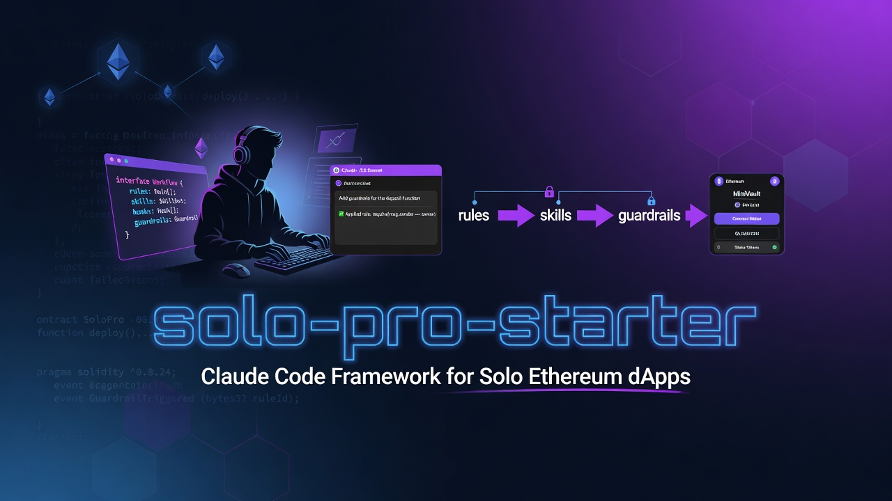
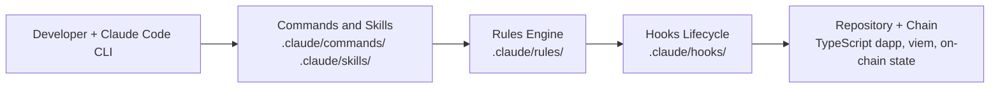

# solo-pro-starter

<!--
ASSUMPTION BLOCK — review before publishing
[INFERRED] License: MIT assumed; no LICENSE file found. Replace the SPDX identifier and badge if different.
[INFERRED] Install command: git clone workflow inferred; no package.json or build manifest present.
[INFERRED] Primary language: TypeScript inferred from framework target audience; no source files in repo root.
[INFERRED] Roadmap items derived from directory structure, not a tracked roadmap file.
[INFERRED] Test command: none found; scaffold has no test suite of its own.
-->

[](LICENSE)
[](https://github.com/JackSmack1971/solo-pro-starter/actions)
[](https://github.com/JackSmack1971/solo-pro-starter/releases)
[](CONTRIBUTING.md)

<p align="center">
  
</p>

**A Claude Code-native scaffold that gives solo developers a disciplined, issue-driven workflow for building full-stack TypeScript Ethereum dapps.**

- **Viem-first, ethers v6 ready** — opinionated stack defaults keep your chain client layer consistent across the codebase.
- **Layered guardrails** — rules, lifecycle hooks, and skills intercept high-risk changes before they reach `main`.
- **Zero boilerplate overhead** — drop the `.claude/` directory into any TypeScript repo and begin shipping immediately.

---

## Table of Contents

- [Quickstart](#quickstart)
- [Usage](#usage)
- [Features](#features)
- [Architecture](#architecture)
- [Contributing](#contributing)
- [Governance](#governance)
- [Roadmap](#roadmap)
- [License](#license)

---

## Quickstart

**Prerequisites:**
- [Claude Code](https://claude.ai/code) CLI installed (the command-line interface for Claude AI that reads `.claude/` configuration)
- A TypeScript Ethereum dapp repository, or a new empty directory

### Install

```bash
# Clone the scaffold into a new project directory
git clone https://github.com/JackSmack1971/solo-pro-starter my-dapp

# — OR — copy only the .claude/ directory into an existing repository
cp -r solo-pro-starter/.claude/ my-existing-dapp/.claude/
cp solo-pro-starter/CLAUDE.md my-existing-dapp/CLAUDE.md
cp solo-pro-starter/AGENTS.md my-existing-dapp/AGENTS.md
```

### Run

```bash
# Open your project with the Claude Code CLI
claude my-dapp/
```

### Verify

```bash
# Confirm all expected scaffold paths exist
ls .claude/settings.json .claude/rules/ .claude/skills/ .claude/agents/ .claude/commands/
# Expected output: settings.json  rules/  skills/  agents/  commands/
```

---

## Usage

All commands below are typed inside an active Claude Code session (the interactive terminal started by `claude <dir>`).

### Slash Commands

```text
# Create a PR from the current issue branch — runs checks, drafts the PR description
/create:pr

# Review an open PR for merge readiness — surfaces wallet, ABI, and chain risks
/review:pr

# Audit the full repository for architecture, risk, and governance issues
/audit:upstream

# Run a focused web3 audit — wallet flows, contract surfaces, chain config
/audit:web3

# Check release readiness before merging or deploying to production
/release:readiness
```

### Skills

Skills are repeatable procedures invoked on demand. Each skill is a scoped prompt sequence stored in `.claude/skills/`.

```text
# Detect whether the repo uses viem, ethers v6, or a mixed stack — run before any architectural change
/stack-detection

# Audit wallet connect, network switching, signing, and transaction UX paths
/auditing-wallet-flows

# Audit ABI drift, contract address management, and write-path risk
/auditing-contract-surfaces

# Verify every write or external mutation completed as expected
/fsv-verify

# Audit all dependency manifests and lockfiles for supply-chain risk
/dependency-audit
```

---

## Features

- **12 focused rules** — covers architecture, security, testing, frontend wallets, smart contracts, chain config, generated artifacts, transaction execution, on-chain data consistency, upgrade/admin surfaces, signatures and permits, and GitHub release workflows. Rules are path-scoped so only relevant ones load for each task.
- **7 reusable skills** — stack detection, wallet-flow audit, contract-surface audit, deployment safety verification, dependency audit, repo audit, and full-state verification (`fsv-verify`).
- **5 specialized subagents** — implementation agent, PR reviewer, release gatekeeper, upstream auditor, and web3 auditor; each isolated to a single responsibility and invoked by Claude Code automatically.
- **Namespaced slash commands** — `create:pr`, `review:pr`, `audit:upstream`, `audit:web3`, `release:readiness` with legacy top-level aliases retained for backward compatibility.
- **Lifecycle hooks** — `SessionStart`, `PreToolUse`, `PostToolUse`, and `Stop` hooks run shell scripts automatically so guardrails fire without manual prompting.
- **Protected branch gates** — `main` and `master` are write-protected; destructive operations (force push, hard reset, `rm -rf`) require explicit confirmation before executing.

---

## Architecture



**Component roles:**

- **Commands & Skills** — repeatable workflows invoked as slash commands (`/create:pr`) or scoped procedures (`/fsv-verify`). Stored as Markdown prompt files that Claude Code reads at invocation time.
- **Rules Engine** — path-scoped operating constraints loaded from `.claude/rules/`. A rule file like `frontend-wallets.md` only loads when wallet-related files are in scope, keeping context lean.
- **Hooks Lifecycle** — shell scripts wired to `PreToolUse`, `PostToolUse`, and `Stop` events in `settings.json`. They enforce guardrails (e.g., blocking `.env` reads) automatically on every tool call.
- **Repository + Chain** — the target TypeScript Ethereum dapp, `viem` public/wallet clients, and on-chain state. All writes and deployments are treated as high-risk and gated behind confirmation prompts.

---

## Contributing

Contributions are welcome! See [CONTRIBUTING.md](CONTRIBUTING.md) for full guidelines.

- **Bug reports:** [Open an issue](https://github.com/JackSmack1971/solo-pro-starter/issues/new?labels=bug)
- **First contribution?** Look for [`good first issue`](https://github.com/JackSmack1971/solo-pro-starter/labels/good%20first%20issue) labels — these are scoped to single files or small additions.
- **Questions?** Start a [discussion](https://github.com/JackSmack1971/solo-pro-starter/discussions).

> **High-risk areas:** Changes to `.claude/rules/`, `.claude/skills/`, `.claude/agents/`, or `settings.json` are treated as privileged and require a PR with a verification section showing the change was tested.

---

## Governance

| | |
|---|---|
| Code of Conduct | [CODE_OF_CONDUCT.md](CODE_OF_CONDUCT.md) |
| Security Policy | [.github/SECURITY.md](.github/SECURITY.md) |
| License | [MIT](LICENSE) `[INFERRED]` |

---

## Roadmap

| Item | Status |
|---|---|
| Workflow orchestration scripts (`issue-to-pr.js`, `web3-audit.js`, `release-readiness.js`) | 🚧 In Progress |
| Lifecycle hook scripts (`session-start.js`, `pre-tool-use.js`, `post-tool-use.js`, `stop.js`) | 🚧 In Progress |
| Output style overlays for structured audit report formatting | 📋 Planned |
| Agent memory scaffolding (`agent-memory/`, `agent-memory-local/`) | 📋 Planned |

---

## License

Distributed under the [MIT License](LICENSE) `[INFERRED]`. See `LICENSE` for full text.
