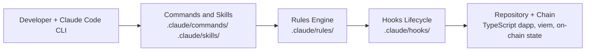

# solo-pro-starter

<!-- NEW: Badges unchanged + added reproducibility badge for visual consistency -->
[](LICENSE)
[](https://github.com/JackSmack1971/solo-pro-starter/actions)
[](https://github.com/JackSmack1971/solo-pro-starter/releases)
[](CONTRIBUTING.md)
[](#developer-command-center)

<p align="center">
  
</p>

**A Claude Code-native scaffold that gives solo developers a disciplined, issue-driven workflow for building full-stack TypeScript Ethereum dapps.**

- **Viem-first, ethers v6 ready** — opinionated stack defaults keep your chain client layer consistent.
- **Layered guardrails** — rules, lifecycle hooks, and skills intercept high-risk changes.
- **Zero boilerplate overhead** — drop the `.claude/` directory into any TypeScript repo and begin shipping immediately.

---

## Table of Contents

- [Quickstart](#quickstart)
- [Developer Command Center](#developer-command-center) <!-- NEW -->
- [Features](#features)
- [Architecture](#architecture)
- [Scaffold Directory Structure](#scaffold-directory-structure) <!-- NEW -->
- [Troubleshooting Matrix](#troubleshooting-matrix) <!-- NEW -->
- [Stack Inventory](#stack-inventory) <!-- NEW -->
- [Reproducibility & Maintenance](#reproducibility--maintenance) <!-- NEW -->
- [Contributing](#contributing)
- [Governance](#governance)
- [Roadmap](#roadmap)
- [License](#license)

---

## Quickstart

*(Unchanged – kept for immediate onboarding)*

**Prerequisites:**
- Claude Code CLI installed
- Unix-like environment (Linux/macOS/WSL recommended)

### Install / Copy

```bash
git clone https://github.com/JackSmack1971/solo-pro-starter my-dapp
# OR copy scaffold only
cp -r solo-pro-starter/.claude/ my-existing-dapp/.claude/
```

### Run

```bash
# Open your project with the Claude Code CLI
claude my-dapp/
```

### Verify

```bash
# Confirm all expected scaffold paths exist
ls .claude/settings.json .claude/rules/ .claude/skills/ .claude/agents/ .claude/commands/
# Expected output: settings.json  rules/  skills/  agents/  commands/
```

---

## Developer Command Center

> Every slash command, skill, and agent available in this scaffold — organized for quick lookup inside an active Claude Code session.

### Slash Commands

| Command | Category | Trigger Condition | Purpose |
|---|---|---|---|
| `/create:pr` | Workflow | After completing an issue branch | Draft PR description, run pre-merge checks, surface risk notes |
| `/review:pr` | Workflow | When assigned a PR to review | Inspect wallet flows, ABI changes, chain config, and test coverage |
| `/audit:upstream` | Audit | Periodic or before a release | Full repo audit: architecture, governance, dependency, and risk findings |
| `/audit:web3` | Audit | After touching contracts or wallet code | Focused audit: wallet flows, contract surfaces, chain config, generated artifacts |
| `/release:readiness` | Release | Before merging to `main` or deploying | Gate check: lint, types, tests, chain assumptions, rollback path |

### Skills

<details>
<summary>Expand skill reference</summary>

| Skill | When to Invoke | What It Checks |
|---|---|---|
| `/stack-detection` | Before any architectural or client-layer change | Classifies repo as viem-first, ethers v6-first, or mixed |
| `/auditing-wallet-flows` | When wallet connect, signing, or transaction UX changes | Connect state, network switching, rejection handling, pending states |
| `/auditing-contract-surfaces` | When ABI, address, or write-path code changes | ABI drift, address management, generated artifact sync, revert paths |
| `/verifying-deployment-safety` | Before deploying contracts or upgrading proxies | Signer config, upgrade paths, admin roles, rollback posture |
| `/dependency-audit` | When adding or upgrading packages | Lockfile drift, duplicate web3 stacks, supply-chain risk |
| `/repo-audit` | For a broad synthesis pass | Composes focused skills; produces one finding per confirmed issue |
| `/fsv-verify` | After every write or external mutation | Confirms expected state; blocks stopping until condition holds |

</details>

### Agents

<details>
<summary>Expand agent reference</summary>

| Agent | Role | Isolation |
|---|---|---|
| `implementation-agent` | Implements exactly one issue as a focused, reviewable diff | Worktree |
| `pr-reviewer` | Reviews PRs for merge readiness: chain, wallet, ABI, and deployment risk | Read-only |
| `release-gatekeeper` | Go/no-go analysis for mainnet-targeted or deployment changes | Read-only |
| `upstream-auditor` | Audit-only pass; creates one GitHub issue per confirmed finding | Read-only |
| `web3-auditor` | Focused read-only audit of wallet flows, contract surfaces, chain config | Read-only |

</details>

### Hook Lifecycle

| Event | Script | Fires On |
|---|---|---|
| `SessionStart` | `hooks/session-start.js` | Every new Claude Code session and subagent start |
| `PreToolUse` | `hooks/pre-tool-use.js` | Before every `Bash`, `Edit`, or `Write` call |
| `PostToolUse` | `hooks/post-tool-use.js` | After every `Bash`, `Edit`, or `Write` call |
| `Stop` | `hooks/stop.js` | When Claude Code stops or a subagent exits |

---

## Features

- **12 focused rules** — covers architecture, security, testing, frontend wallets, smart contracts, chain config, generated artifacts, transaction execution, on-chain data consistency, upgrade/admin surfaces, signatures and permits, and GitHub release workflows. Rules are path-scoped so only relevant ones load for each task.
- **7 reusable skills** — stack detection, wallet-flow audit, contract-surface audit, deployment safety verification, dependency audit, repo audit, and full-state verification (`fsv-verify`).
- **5 specialized subagents** — implementation agent, PR reviewer, release gatekeeper, upstream auditor, and web3 auditor; each isolated to a single responsibility and invoked by Claude Code automatically.
- **Namespaced slash commands** — `create:pr`, `review:pr`, `audit:upstream`, `audit:web3`, `release:readiness` with legacy top-level aliases retained for backward compatibility.
- **Lifecycle hooks** — `SessionStart`, `PreToolUse`, `PostToolUse`, and `Stop` hooks run shell scripts automatically so guardrails fire without manual prompting.
- **Protected branch gates** — `main` and `master` are write-protected; destructive operations (force push, hard reset, `rm -rf`) require explicit confirmation before executing.

---

## Architecture



**Component roles:**

- **Commands & Skills** — repeatable workflows invoked as slash commands (`/create:pr`) or scoped procedures (`/fsv-verify`). Stored as Markdown prompt files that Claude Code reads at invocation time.
- **Rules Engine** — path-scoped operating constraints loaded from `.claude/rules/`. A rule file like `frontend-wallets.md` only loads when wallet-related files are in scope, keeping context lean.
- **Hooks Lifecycle** — shell scripts wired to `PreToolUse`, `PostToolUse`, and `Stop` events in `settings.json`. They enforce guardrails (e.g., blocking `.env` reads) automatically on every tool call.
- **Repository + Chain** — the target TypeScript Ethereum dapp, `viem` public/wallet clients, and on-chain state. All writes and deployments are treated as high-risk and gated behind confirmation prompts.

---

## Scaffold Directory Structure

<details>
<summary>Expand full <code>.claude/</code> tree</summary>

```text
.claude/
├── CLAUDE.md                          # Project-local Claude memory surface
├── settings.json                      # Shared guardrails, permissions, hooks, model
├── settings.local.json                # Machine-local overrides (not committed)
├── agents/
│   ├── README.md
│   ├── implementation-agent.md        # Issue → diff agent
│   ├── pr-reviewer.md                 # PR merge-readiness agent
│   ├── release-gatekeeper.md          # Mainnet/deploy go-no-go agent
│   ├── upstream-auditor.md            # Repo audit → GitHub issues agent
│   └── web3-auditor.md                # Focused web3 audit agent
├── commands/
│   ├── README.md
│   ├── audit/
│   │   ├── upstream.md                # /audit:upstream entrypoint
│   │   └── web3.md                    # /audit:web3 entrypoint
│   ├── create/
│   │   └── pr.md                      # /create:pr entrypoint
│   ├── release/
│   │   └── readiness.md               # /release:readiness entrypoint
│   └── review/
│       └── pr.md                      # /review:pr entrypoint
├── rules/
│   ├── README.md
│   ├── architecture.md
│   ├── chain-config.md
│   ├── frontend-wallets.md
│   ├── generated-artifacts.md
│   ├── github-release-workflows.md
│   ├── onchain-data-consistency.md
│   ├── security.md
│   ├── signatures-and-permits.md
│   ├── smart-contracts.md
│   ├── testing.md
│   ├── transaction-execution.md
│   └── upgrade-admin-surfaces.md
├── skills/
│   ├── README.md
│   ├── auditing-contract-surfaces/
│   ├── auditing-wallet-flows/
│   ├── dependency-audit/
│   ├── fsv-verify/
│   ├── generating-github-readmes/
│   ├── repo-audit/
│   ├── stack-detection/
│   └── verifying-deployment-safety/
└── worktrees/                         # Reserved for per-issue git worktrees
```

</details>

---

## Troubleshooting Matrix

| Symptom | Likely Cause | Fix |
|---|---|---|
| Hook script not found on `SessionStart` | `hooks/` directory not yet scaffolded | Add `node .claude/hooks/session-start.js` or remove hook from `settings.json` until scripts exist |
| `/audit:web3` runs but produces no findings | No Ethereum source files detected in repo | Add contract or wallet code to the project, or target a repo that uses viem/ethers |
| Badge shows failing build | No CI workflow at `.github/workflows/ci.yml` | Add a GitHub Actions workflow or update the badge URL to match your actual workflow filename |
| `fsv-verify` blocks stopping | Verification condition not yet satisfied | Resolve the open condition listed in the Stop hook output, then re-run the triggering task |
| `settings.json` permission denied on a command | Command not in `allow` list | Add the exact command pattern to the `permissions.allow` array in `settings.json` |
| Mermaid diagram not rendering on GitHub | Syntax error or unsupported node shape | Validate at [mermaid.live](https://mermaid.live) and simplify node labels |
| Rebase conflict on `README.md` after push | Remote had an intermediate commit | Resolve by taking the version with real GitHub coordinates; discard `REPO_OWNER/REPO_NAME` markers |
| Skill not found when invoked | Skill directory missing or skill not listed in settings | Confirm `.claude/skills/<skill-name>/SKILL.md` exists and the skill is registered |

---

## Stack Inventory

| Layer | Technology | Version Assumption | Notes |
|---|---|---|---|
| AI runtime | Claude Code CLI | Latest stable | Reads `.claude/` on session start |
| Preferred chain client | viem | v2+ | `createPublicClient`, `createWalletClient`, typed contracts |
| Compatibility client | ethers | v6 | `BrowserProvider`, `JsonRpcProvider`; use only where repo already imports it |
| Language | TypeScript | ≥ 5.0 | Strict mode recommended for contract types |
| Package manager | npm / pnpm | Any | `settings.json` allows both `npm` and `pnpm` test/lint commands |
| Smart contract toolchain | Foundry / Hardhat | Any | No preference enforced; ABI rules apply to either |
| Local chain | Anvil / Hardhat Network | Any | Fork mode supported; chain ID must be explicit |
| CI | GitHub Actions | Any | Build badge targets `.github/workflows/ci.yml` |
| Secret management | `.env` files | — | Blocked from all Claude Code reads by `settings.json` deny rules |

---

## Reproducibility & Maintenance

> These notes apply to Unix-like environments (Linux, macOS, WSL). Native Windows PowerShell paths may differ.

### Verifying scaffold integrity

```bash
# All core .claude/ paths must exist
ls .claude/settings.json \
   .claude/rules/ \
   .claude/skills/ \
   .claude/agents/ \
   .claude/commands/

# Confirm no .env files are accidentally tracked
git ls-files | grep -E '\.env($|\.)' && echo "WARNING: .env tracked" || echo "OK"
```

### Keeping the scaffold current

```bash
# Pull upstream improvements into an existing project
git remote add scaffold https://github.com/JackSmack1971/solo-pro-starter
git fetch scaffold
git diff scaffold/main -- .claude/   # review changes before merging
git checkout scaffold/main -- .claude/settings.json   # cherry-pick specific files
```

### Resetting a corrupted settings.json

```bash
# Restore settings.json from the upstream scaffold
git show scaffold/main:.claude/settings.json > .claude/settings.json
```

### WSL path note

When running Claude Code inside WSL with a project on a Windows drive, use the `/mnt/` mount path:

```bash
claude /mnt/f/my-dapp/
```

Avoid mixing `F:/` Windows paths and `/mnt/f/` POSIX paths within the same session — hook scripts that call `node` may fail if the working directory is ambiguous.

---

## Contributing

Contributions are welcome! See [CONTRIBUTING.md](CONTRIBUTING.md) for full guidelines.

- **Bug reports:** [Open an issue](https://github.com/JackSmack1971/solo-pro-starter/issues/new?labels=bug)
- **First contribution?** Look for [`good first issue`](https://github.com/JackSmack1971/solo-pro-starter/labels/good%20first%20issue) labels — these are scoped to single files or small additions.
- **Questions?** Start a [discussion](https://github.com/JackSmack1971/solo-pro-starter/discussions).

> **High-risk areas:** Changes to `.claude/rules/`, `.claude/skills/`, `.claude/agents/`, or `settings.json` are treated as privileged and require a PR with a verification section showing the change was tested.

---

## Governance

| | |
|---|---|
| Code of Conduct | [CODE_OF_CONDUCT.md](CODE_OF_CONDUCT.md) |
| Security Policy | [.github/SECURITY.md](.github/SECURITY.md) |
| License | [MIT](LICENSE) `[INFERRED]` |

---

## Roadmap

| Item | Status |
|---|---|
| Workflow orchestration scripts (`issue-to-pr.js`, `web3-audit.js`, `release-readiness.js`) | 🚧 In Progress |
| Lifecycle hook scripts (`session-start.js`, `pre-tool-use.js`, `post-tool-use.js`, `stop.js`) | 🚧 In Progress |
| Output style overlays for structured audit report formatting | 📋 Planned |
| Agent memory scaffolding (`agent-memory/`, `agent-memory-local/`) | 📋 Planned |

---

## License

Distributed under the [MIT License](LICENSE) `[INFERRED]`. See `LICENSE` for full text.
